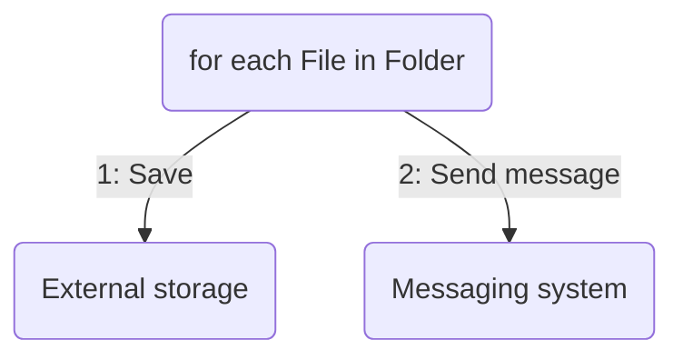

# filem - the simple File Messenger

Send files from folder to Storage + Message



## Usage
```sh
Usage: filem [--file FILE] [--dry-run] [--verbose]

Options:
  --file FILE, -f FILE   Configfile [default: filem.yaml]
  --dry-run              Perform a dry-run / what-if
  --verbose, -v          Verbose logging
  --help, -h             display this help and exit
  --version              display version and exit
```

## Message result
(currently only JSON)

Message is constructed using an "externalData" object containing the link to the resource and some generated valies (starting with '`_`'), static values from the Folder-setting and the dynamic values extracted in the file-matching.
```json
{
  "_filename": "area314.txt",
  "_location": "examples/filedrop/area314.txt",
  "_modified": "2023-03-13T13:59:52.037008375+01:00",
  "_size": 32,
  "env": "prod",
  "externalData": {
    "txt": {
      "url": "https://mystorageaccount.blob.core.windows.net/mycontainer/area-314/2023-03/2023-03-13_51F4CA2B-AF0D-2904-37E2-50F789506C18.txt",
      "headers": [
        "Authentication": "Bearer 1234..."
      ]
    }
  },
  "id": "314",
  "source": "filedrop",
  "type": "delta",
  "version": 1
}
```

The `externalData` is meant to be accessible by a plain HTTP GET using the specified url (which might include query-params) and using any HTTP-Headers that might exist.

## Example
Please see the `Makefile` and the `examples`-folder

## Configuration
The `filem.yaml` has 3 parts: Folders, Storage and Message, and 1 optional: Metrics

Enviroment variables can be use in the file using the `$(ENV_VAR_NAME)` notation (see below)

## Folder-settings
This is how to find files to process

```yaml
folders:
  - location: examples/filedrop          # folder to search
    filter: "area(?P<id>[0-9]{3}).txt"   # regex of files to match
    targetName: "area-%(id)/%(yyyy-mm)/%(yyyy-mm-dd)_%(uid).txt"
    onSuccess: delete                    # unspecified -> leave as is, or 'delete'
    format: txt                          # key in the "externalData" above
    tags:
      source: filedrop                   # static key+values in the message
      version: 1
      env: prod
      type: delta
```
### `filter` syntax
See the [Golang Regexp Syntax](https://pkg.go.dev/regexp/syntax) for documentation

### `targetName` rules
If the `targetName` is missing then then actual filename is used, otherwise it supports some dynamic content using the `%(type)` notation:
| type | description |
| ---- | ----------- |
| `yy`, `yyyy` | Current year with 2 and 4 digits |
| `yy-mm`, `yyyy-mm` | Current Year with 2 and 4 digits + month |
| `yy-mm-dd`, `yyyy-mm-dd` | Current year with 2 and 4 digits + month & day |
| `mm` | Current month (2 digits) |
| `dd` | Current day of month (2 digits) |
| `uid`, `uuid` or `guid` | Random UUID (not RFC4122-compliant) |
| any named variable from the `filter` regex | extracted value |
| any number (1+) | that positional value from the `filter` regex


## Storage-settings
```yaml
storage:
  azure:
    account: $(AZURE_ACCOUNT)
    key: $(AZURE_ACCESSKEY)
    container: $(AZURE_CONTAINER)
    sasTimeout: 192h                # 8 days -> 192 hours
```
### Supported storages
*  Azure Storage Account - Blob Container
   
   Authentication uses the 'Access-Key' model and creates a SAS-key with the specified timeout on each run.

   Note: If you rotate the access-key, all SAS-keys created using it will stop working as well.

## Message-settings
```yaml
message:
  format: default/json
  kafka:
    endpoint: SASL_SSL://$(KAFKA_HOST).westeurope.azure.confluent.cloud:9092
    topic: $(KAFKA_TOPIC)
    key: $(KAFKA_APIKEY)
    secret: $(KAFKA_SECRET)
```

### Supported messaging systems
* Kafka

## Metric-settings
```yaml
metrics:
  prompush:
    url: http://localhost:9091/metrics/job/filem_example/instance/example-instance
```

### Supported metrics systems
* Prometheus Pushgateway
